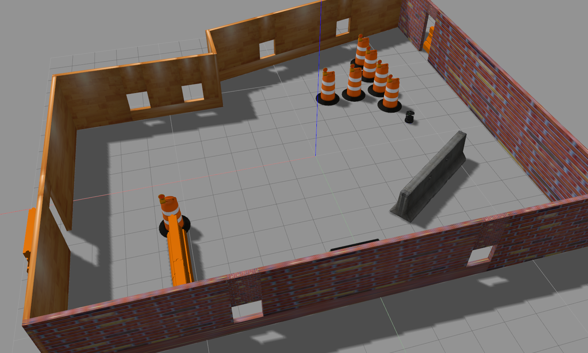
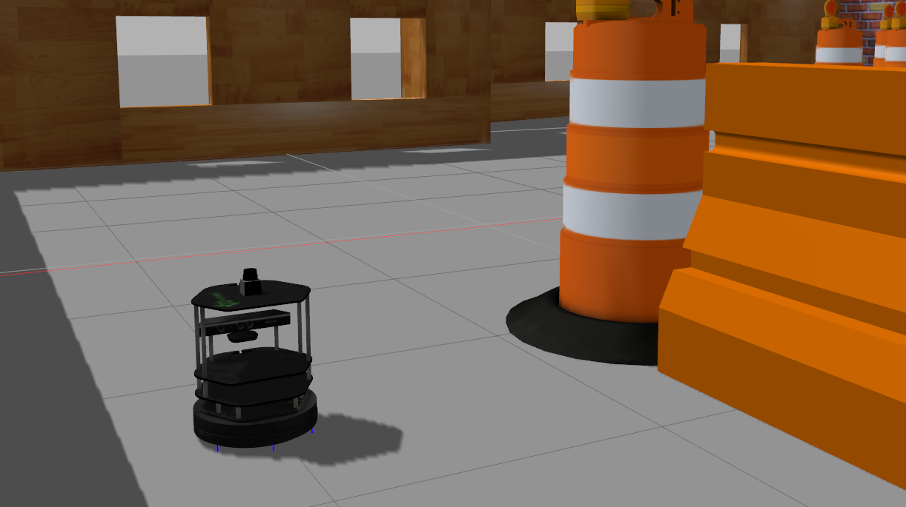
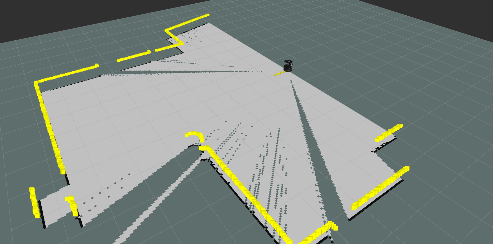
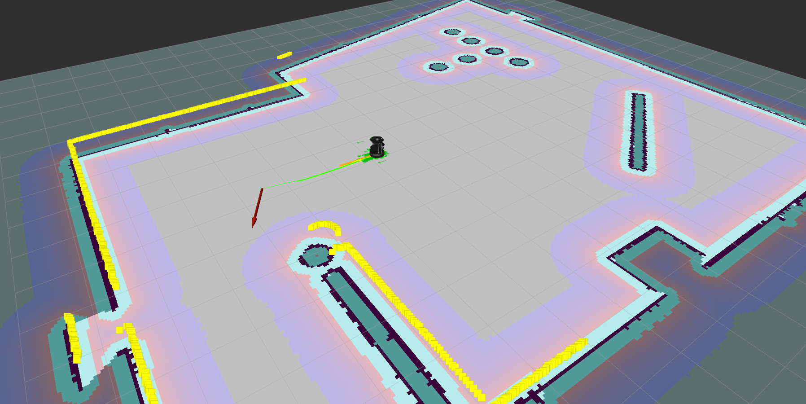
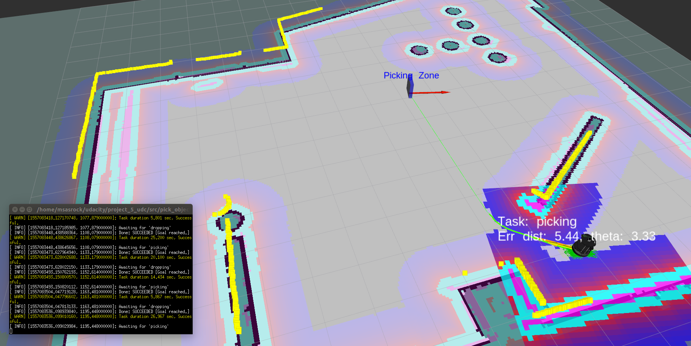
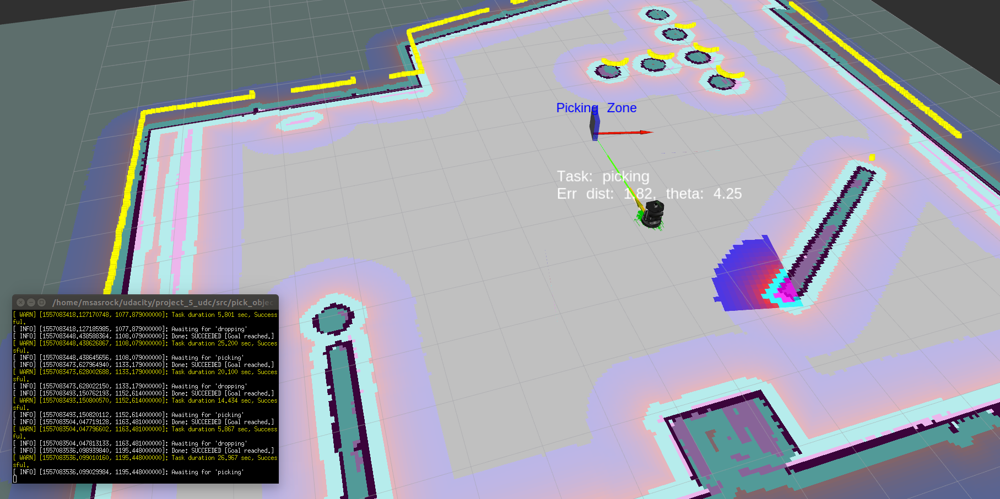
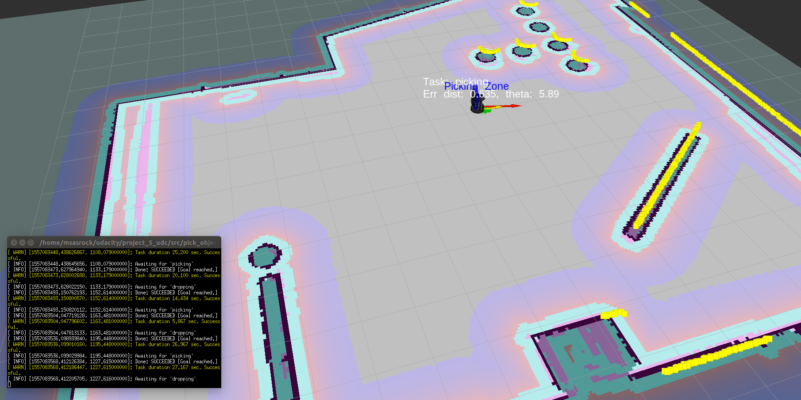
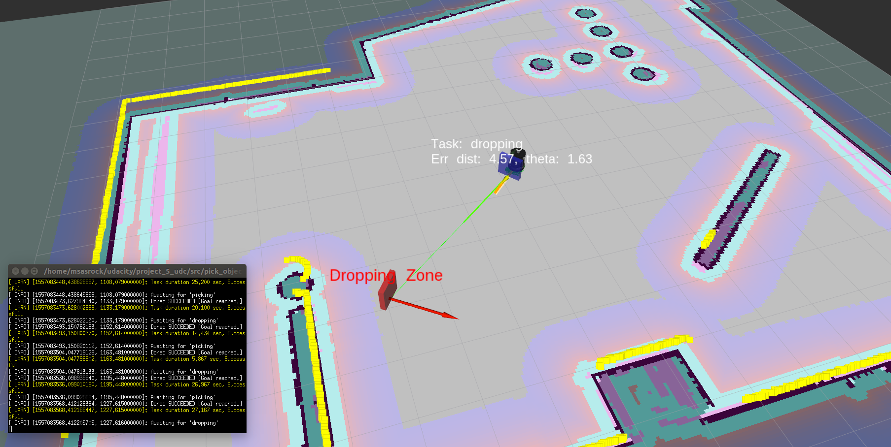
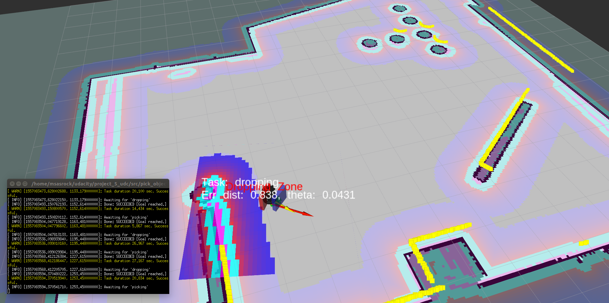

# Home Service Robot

## Description

### Contents

#### Packages of this repo
* **add_markers** pkg:  Publishes markers of subgoal, and text information.
* **pick_objects** pkg: Determines where is the next subgoal for either _picking_ or _dropping_ zone.
* **pick_msgs** pkg: Contains a custom ROS message that eases the communication between **pick_objects** and **add_markers**.
* **demo** pkg: Contains all environment data and some demo launch files. 
* **turtlebot_my_extra** pkg: Generates an additional laser scanner device for the turtlebot.
* <a href="https://github.com/turtlebot/turtlebot_interactions">turtlebot_interactions</a> pkg: Contains visualization tools.

#### Additinal required packages
* <a href="https://github.com/ros-perception/slam_gmapping">slam_gmapping</a>
* <a href="https://github.com/turtlebot/turtlebot">turtlebot</a>
* <a href="https://github.com/turtlebot/turtlebot_simulator">turtlebot_simulator</a>

### Simulator Environments
- Here is the simulated world for Home Service Functions
<br>
- The <a href="http://wiki.ros.org/turtlebot">Turtlebot</a> equipped with a laser scanner is used in this test.
<br>

## Usage

### Test SLAM
Here, we rely on the <a href="http://wiki.ros.org/gmapping">slam_mapping</a> for the construction of 2D map.
```
$ source <your_workspace>/scripts/test_slam.sh
```
<br>
To save the map,
```
$ rosrun map_server map_saver -f $(rospack find demo)/maps/my_lab
```

### Test Localization and Navigation

```
$ source <your_workspace>/scripts/test_navigation.sh
```
<br>

### Test Home Service Functions

```
$ source <your_workspace>/scripts/home_service.sh
```
How it works
1. The __pick_objects__ node generates a position of the picking zone.
2. The __add_markers__ node shows the marker (blue box marker) at the picking zone.
<br>
3. The robot moves autonomously to the picking zone.
<br>
4. When the robot reaches the subgoal, the __pick_object__ node waits for 5 seconds before generating a new position for the dropping zone.
<br>
5. The __add_markers__ node shows the marker (red box marker) at the dropping zone.
6. The robot carries the item (blue box marker) to the dropping zone. 
<br>
7. After reaching the dropping zone, all markers disappear. The __pick_objects__ node waits for another 5 second before executing next task.
<br>
8. The system subsequently repeats from the step 1 to 7 again.